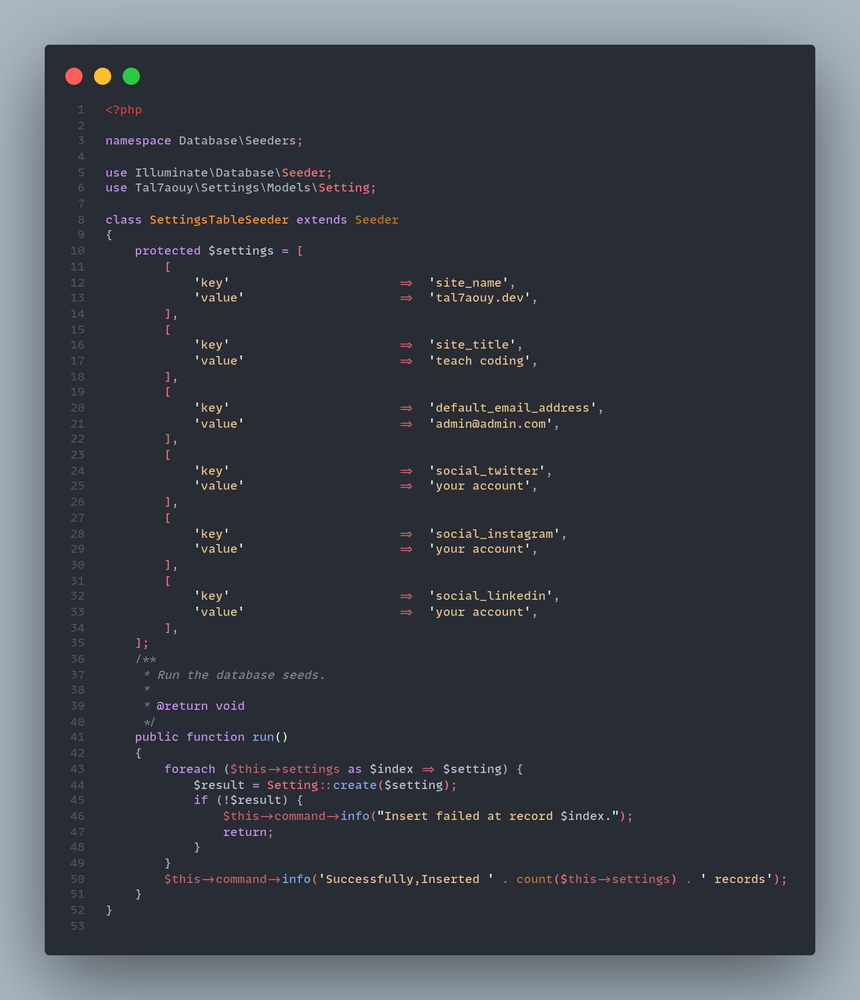
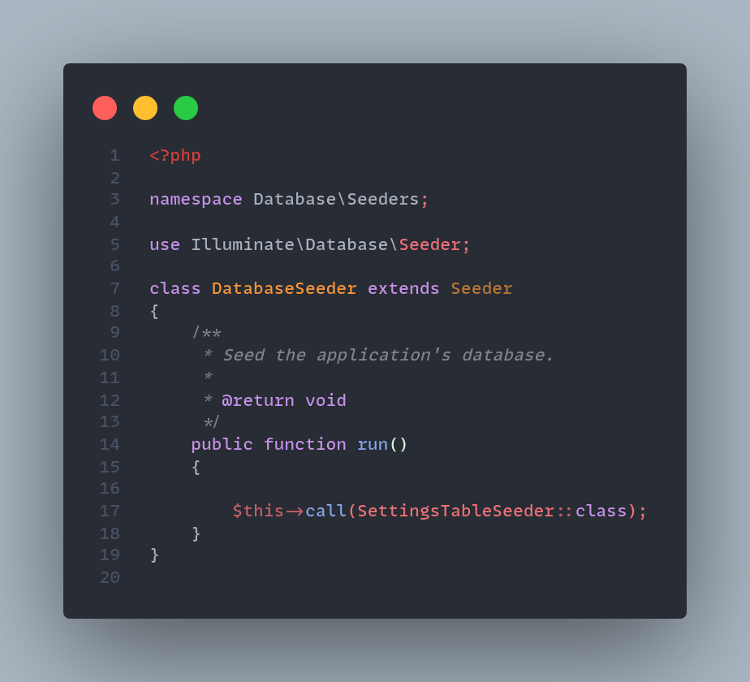

# Laravel Settings

Any web application’s backend needs to have some sort of a settings from where you can change the various settings of your application.

for example you have an e-commerce app, you would like to have some settings such as site name, logos, shipping methods control, payment methods control ...

# Usage

## Installation

```bash
    composer require tal7aouy/settings
```

-   we will add a database seed for our settings table. Run below command in the terminal.

```bash
php artisan make:seed SettingsTableSeeder
```

here you can add all settings that you want for you application. 👇



call your `SettingsTableSeeder` in `DatabaseSeeder` class



now is the final step, run these commands to migrate `settings` table and Seed the database with records.

```bash
php artisan migrate
// then
php artisan db:seed
```

## License

Laravel Settings is an open-sourced software licensed under the [MIT LICENSE](LICENSE)
